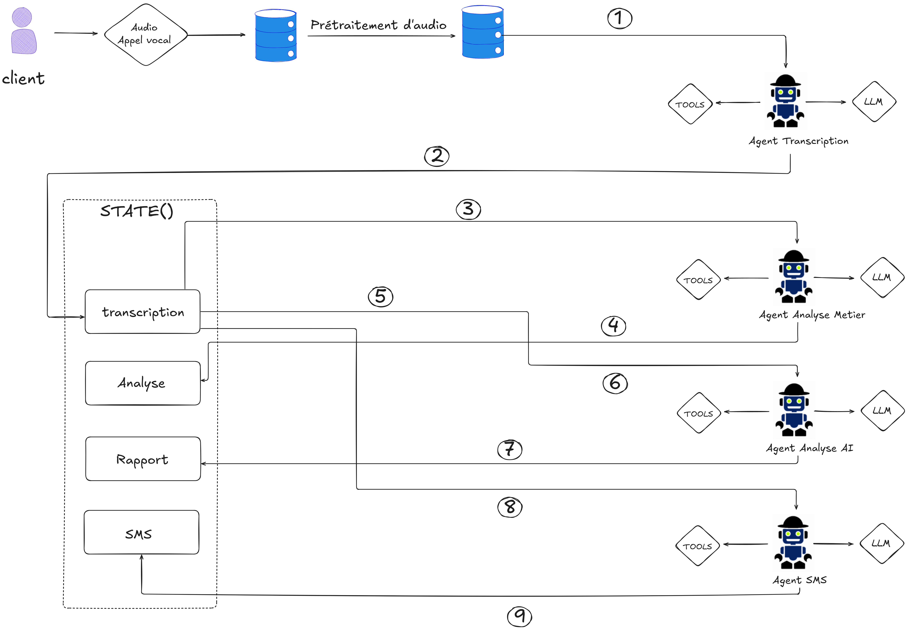
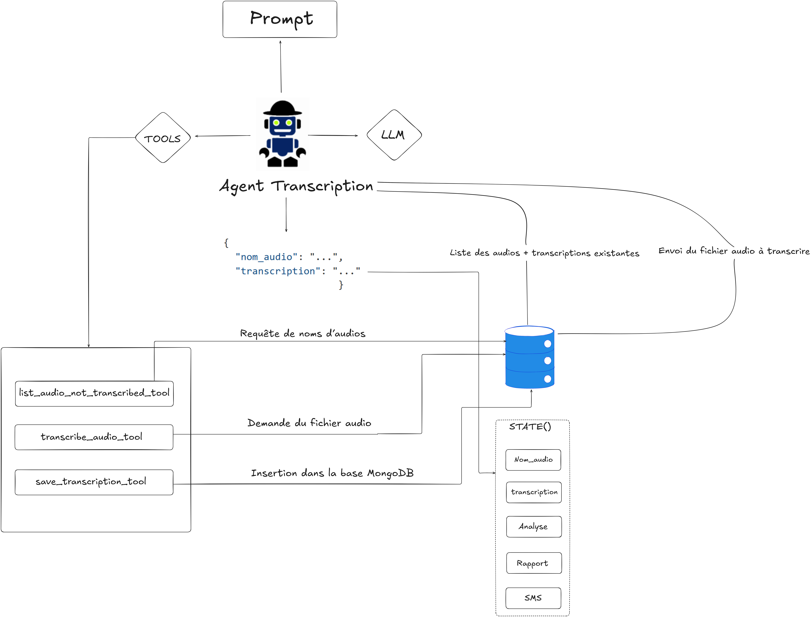
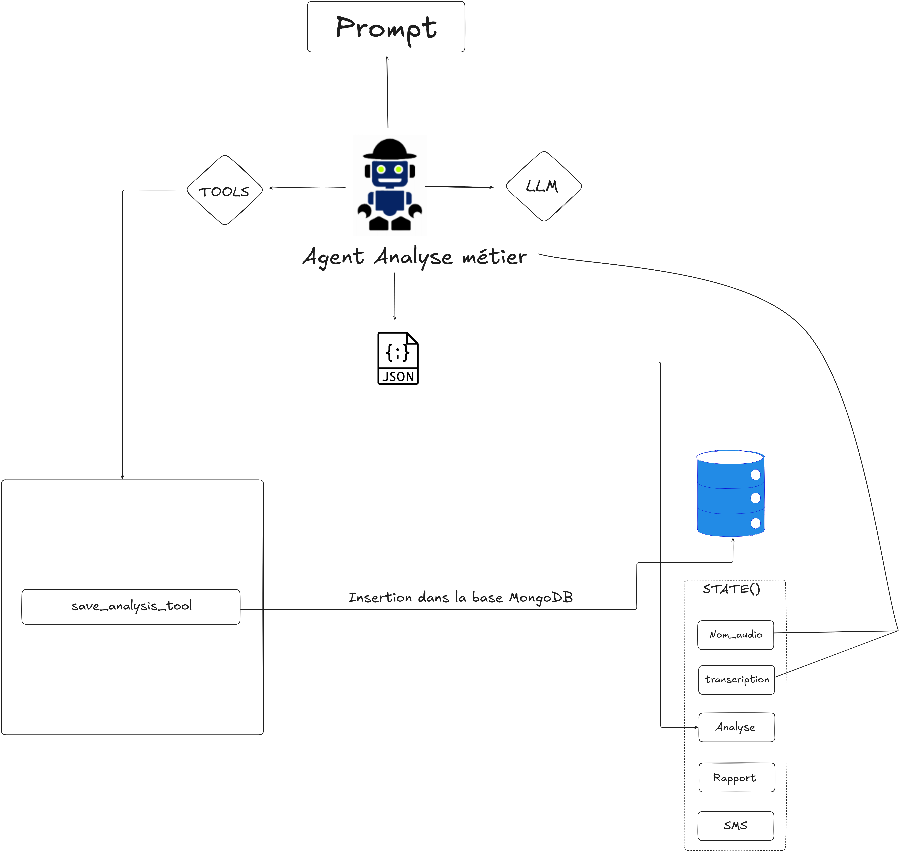

# Projet Multi-Agent pour l’Analyse Automatique des Appels Clients

Ce projet implémente une architecture **multi-agent** orchestrée avec **LangGraph** pour automatiser le traitement des appels clients.
Les agents travaillent en chaîne : **Transcription → Analyse → Rapport exploratoire → Envoi de SMS**.

---

## **1. Architecture Globale**

  
*(Ajoute ici l'image de ton architecture globale)*

---

## **2. Structure du Projet**

```
projet_multiagent_vf/
│
├── agents/
│   ├── agent_transcription.py   # Agent de transcription des audios via Gemini ou Whisper
│   ├── agent_analyse.py         # Analyse sémantique des transcriptions
│   ├── agent_exploratoire.py    # Génération de rapports exploratoires
│   ├── agent_sms.py             # Génération et envoi des SMS
│
├── tools/                       # Outils techniques (MongoDB, Twilio, etc.)
│
├── Traitement_Audio/            # Scripts liés au traitement audio
│
├── config.py                    # Configuration (API Keys, MongoDB, Twilio, etc.)
├── main_graph.py                # Orchestration et exécution du graphe multi-agent
├── rapport_analyse.md           # Exemple de rapport exploratoire (Markdown)
├── requirements.txt             # Dépendances Python
└── README.md                    # Documentation du projet
```

---

## **3. Description des Fichiers Principaux**

- **`main_graph.py`**  
  Définit le graphe d’orchestration des agents avec **LangGraph**.  
  Les étapes principales sont :  
  1. **TranscriptionAgent** : Récupère et transcrit un fichier audio.  
  2. **AnalyseAgent** : Analyse sémantique du texte transcrit.  
  3. **RapportAgent** : Génère un rapport exploratoire et des insights.  
  4. **SmsAgent** : Envoie un SMS résumant l'appel au client.  

- **`config.py`**  
  Contient la configuration des clés API (OpenAI, Twilio, MongoDB, etc.).

- **`rapport_analyse.md`**  
  Exemple de rapport d’analyse exploratoire des appels clients, incluant tendances, problèmes et recommandations.

---

## **4. Architecture des Agents**

**Agent Transcription.  

  

**Agent analyse métier.  

  


**Agent analyse AI.  

  

**Agent sms.  

  
---

## **5. Installation**

1. **Cloner le projet** :
   ```bash
   git clone https://github.com/youssefyaslane/PROJET_MULTIAGENTS.git
   cd PROJET_MULTIAGENTS
   ```

2. **Installer les dépendances** :
   ```bash
   pip install -r requirements.txt
   ```

3. **Configurer `config.py`** :
   - Ajouter vos clés API OpenAI / Twilio.
   - Vérifier `MONGO_URI` pour la connexion à MongoDB.

---

## **6. Lancer le Pipeline Multi-Agent**

Exécuter :
```bash
python main_graph.py
```

Le script traitera les fichiers audio dans MongoDB, générera les transcriptions, analysera les résultats et enverra des SMS.

---

## **7. Rapport Exploratoire**

Un exemple de rapport est disponible dans [rapport_analyse.md](rapport_analyse.md).  
Il inclut les **insights clés**, **tendances récurrentes** et **propositions d’amélioration**.

---

## **8. Auteurs**
- **Équipe Data Orange Maroc**
- Youssef Yaslane (Data Scientist / AI Engineer)
